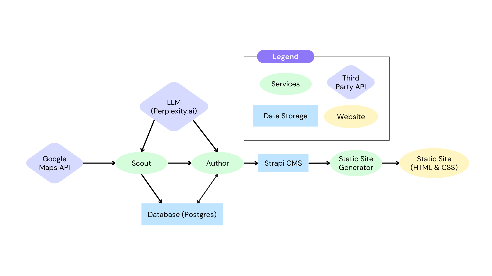

# LLM Powered Business Article Generator

This project is intended to be an automated pipeline that generates articles using an LLM, then publishes them on a website. The goal is to automate the entire process so that it can generate and publish content entirely autonomously.

## TODO

- [ ] Add some needed error handling
- [ ] Add testing
- [ ] Work on logging for services
- [X] Add hooks for site generator to auto-update
- [X] Filtering of places for scout
- [ ] Implement activities and locations files into scout
- [X] Fix city issue
- [X] If site generator service is down, be able to generate missed webhook sites when generator is back up
- [ ] Evalute speed of page generation
- [X] Dockerize services for deployment

## Architecture Diagram

## Project Structure

### Folders

- services
  - author
  - scout
  - ssg
  - db
- shared
- website

### Services

#### Scout

The scout service uses the Google Places API (New) to learn about new businesses and gather data on them. It stores the gathered data in a sqlite database that it shares with the other services.

Currently this service needs the most work. The main issue is finding a way to effectively filter the businesses it gathers.

#### Author

The author service takes business data that was scraped by the scout and prompts an LLM to write the article content. The results of this prompt are formatted and stored in a content management system (CMS). We are currently using Strapi CMS to manage content.

This service should be set up as a cron job to run periodically. It generates articles as long as there articles the scout has vetted. Once it runs out of vetted articles to search, it will exit to save compute power. It shoud be periodically run to begin generating content again if it exits.

#### Site Generator (SSG)

The site generator service gets data from the CMS and turns the content into pre-rendered html pages that can be served to users quickly.

This is actually a flask server and acts as an endpoint for a strapi webhook. The webhook is triggered when an article is published. This service should be run in the background.

#### Strapi CMS

This is a third party content managament system that we are using to store the article content. It allows for anyone (with proper login info) to edit the pages' content.

#### Database

Currently I'm using a postgres database for storing data needed by the author and scout
